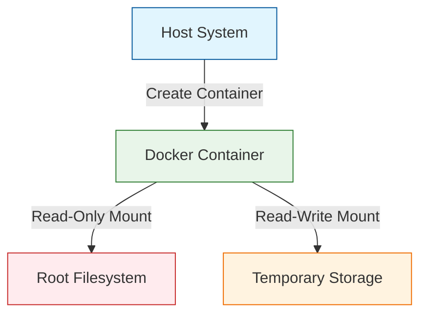

# 🔒 Docker Read-Only File System Implementation

[](https://github.com/TheToriqul/docker-readonly-filesystem)
[](https://github.com/TheToriqul/docker-readonly-filesystem)
[](https://github.com/TheToriqul/docker-readonly-filesystem)

## 📋 Overview

Through this project, I've implemented a secure Docker container configuration focusing on read-only file systems - a critical security measure in modern containerized environments. This implementation demonstrates my growing expertise in Docker security practices and container hardening techniques.

## 🏗 Technical Architecture

The project implements a security-focused container architecture that enforces immutability through read-only file systems.



## 💻 Technical Stack

- Frontend: None
- Backend: 
  - 
  - 
- Security: 
  - 

## ⭐ Key Features

1. Secure Container Configuration
   - Read-only root filesystem implementation
   - Minimal base image selection
   - Security-focused Docker configurations

2. File System Management
   - Read-only mount points
   - Temporary storage allocation
   - Proper permission handling

3. Security Measures
   - Filesystem immutability
   - Runtime modification prevention
   - Enhanced container isolation

4. Verification Systems
   - Mount point validation
   - Permission verification
   - Security testing procedures

## 📚 Learning Journey

### Technical Mastery:

1. Docker security best practices implementation
2. Container filesystem architecture understanding
3. Read-only filesystem configuration expertise
4. Security hardening techniques
5. Container isolation principles

### Professional Development:

1. Security-first mindset development
2. Documentation skills enhancement
3. Problem-solving in containerized environments
4. Enterprise-grade security implementation
5. DevSecOps practices

## 🔄 Future Enhancements

<details>
<summary>View Planned Improvements</summary>

1. Multi-stage build implementation
2. Custom security policy integration
3. Automated security testing
4. Volume management optimization
5. Monitoring system integration
6. CI/CD pipeline integration
</details>

## ⚙️ Installation

<details>
<summary>View Installation Details</summary>

### Prerequisites

- Docker Engine installed
- Basic understanding of Docker commands
- Terminal access

### Setup Steps

1. Clone the repository:
```bash
git clone https://github.com/TheToriqul/docker-readonly-filesystem.git
```

2. Navigate to project directory:
```bash
cd docker-readonly-filesystem
```

3. Build the Docker image:
```bash
docker build -t readonly-test .
```

### Configuration

```env
# No environment variables required for basic setup
```

</details>

## 📖 Usage Guide

<details>
<summary>View Usage Details</summary>

### Basic Usage

1. Run container with read-only filesystem:
```bash
docker run --rm -it --read-only readonly-test
```

2. Verify read-only status:
```bash
docker inspect container_name | grep ReadonlyRootfs
```

### Troubleshooting

Common issues and solutions are documented in the script-commands.md file.

</details>

## 📫 Contact

- 📧 Email: toriqul.int@gmail.com
- 📱 Phone: +65 8936 7705, +8801765 939006

## 🔗 Project Links

- [GitHub Repository](https://github.com/TheToriqul/docker-readonly-filesystem)
- [Documentation](https://github.com/TheToriqul/docker-readonly-filesystem/blob/main/README.md)

## 👏 Acknowledgments

- [Poridhi for excellent labs](https://poridhi.io/)
- Docker documentation for security best practices
- Container security community

---

Feel free to explore, modify, and build upon this configuration as part of my learning journey. You're also welcome to learn from it, and I wish you the best of luck!